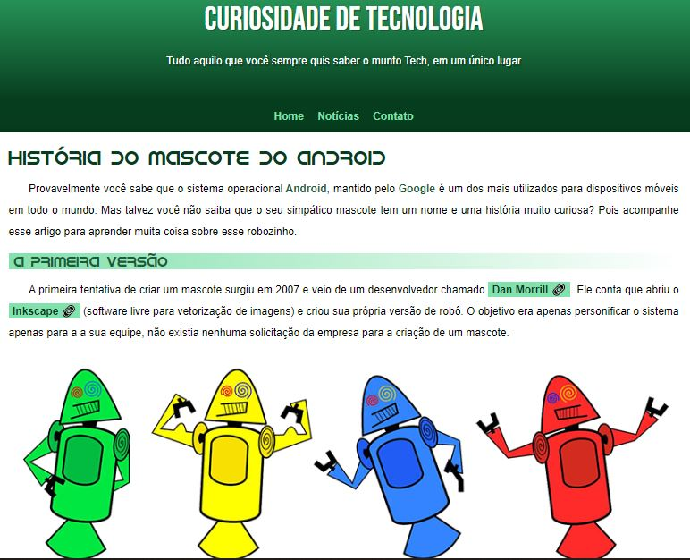

<h1 text-align: center;># projeto-android</h1>

Projeto Android criado no Capítulo 17 do curso de HTML e CSS

 <a href="#-tecnologias">Tecnologias</a>&nbsp;&nbsp;&nbsp; |&nbsp;&nbsp;&nbsp;
 <a href="#-projeto">Projeto</a>&nbsp;&nbsp;&nbsp; |&nbsp;&nbsp;&nbsp; 
<a href="#memo-licença">Licença</a>

  

 

 

## 🚀 Tecnologias

Esse projeto foi desenvolvido com as seguintes tecnologias:

- HTML e CSS
- Git e Github

## 💻 Projeto

E um site que conta a história do mascote Android.

- Visite o projeto online (https://fiamadev.github.io/projeto-android/)

## : memo : Licença

Esse projeto está sob a linceça MIT.

